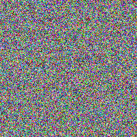

# Random Bitmap image generator

Small program generating random bitmap images.

# Getting started

```console
$ git clone https://github.com/antoinelrnld/bitmap
$ cd ./bitmap
$ make
```

# Usage

```console
$ randomimage {width} {height}
```

## Example

```console
$ randomimage 200 200
```

### Result

